# JWIT – Jamshedpur Women in Technology

A modern, multi-page community website built with **React + Vite + Styled-Components**, designed for events, learning resources, sponsorship, and community engagement.

This project represents the official platform of **JWIT: Jamshedpur Women in Technology**, enabling women in the region to discover opportunities, join events, explore learning tracks, and connect with mentors.

---

## 🔗 Live Demo & Repository

### **🌍 Live Website**

https://a2rp.github.io/jwit-website/

### **📦 GitHub Repository**

https://github.com/a2rp/jwit-website

---

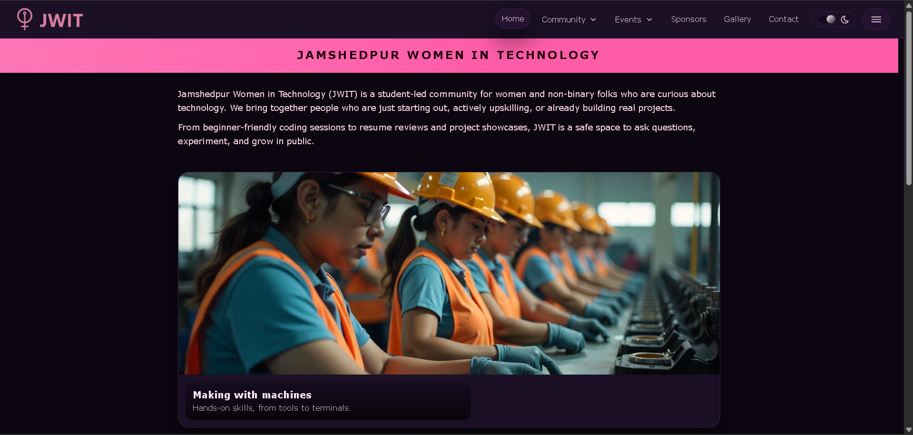

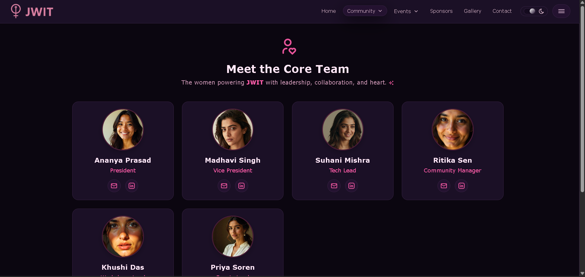

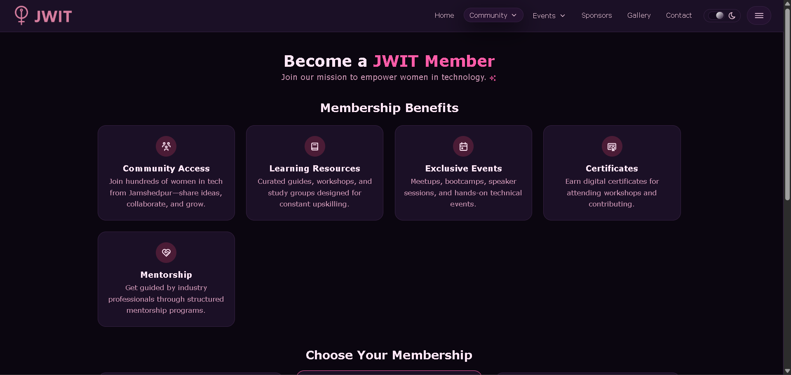

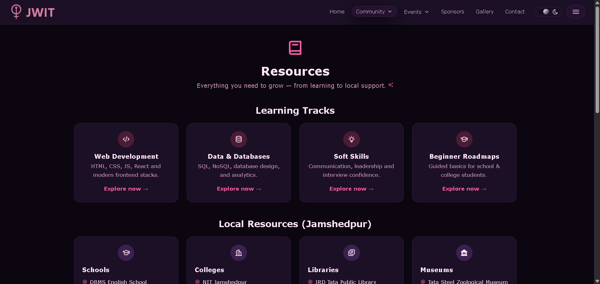

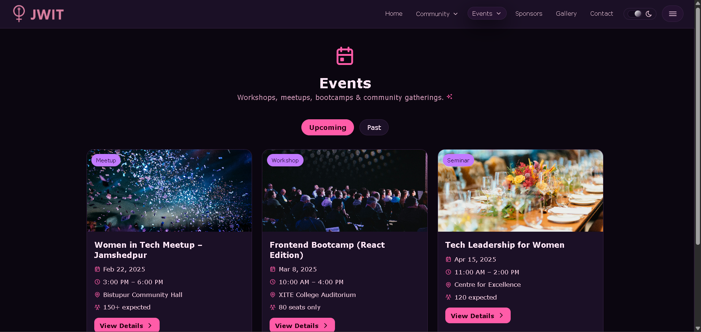

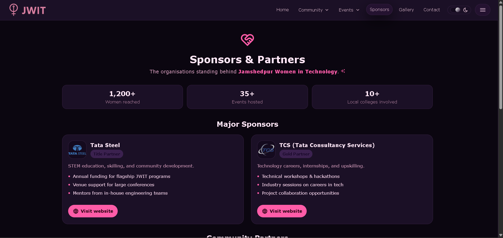

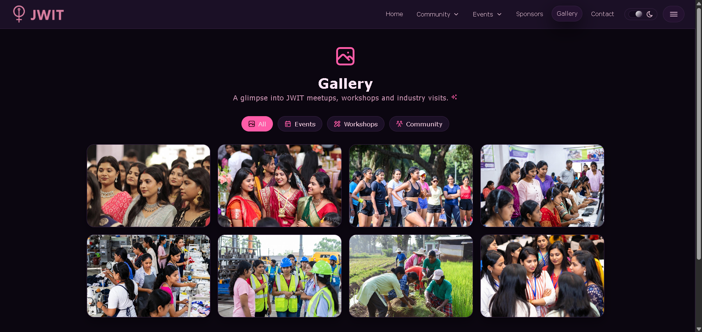

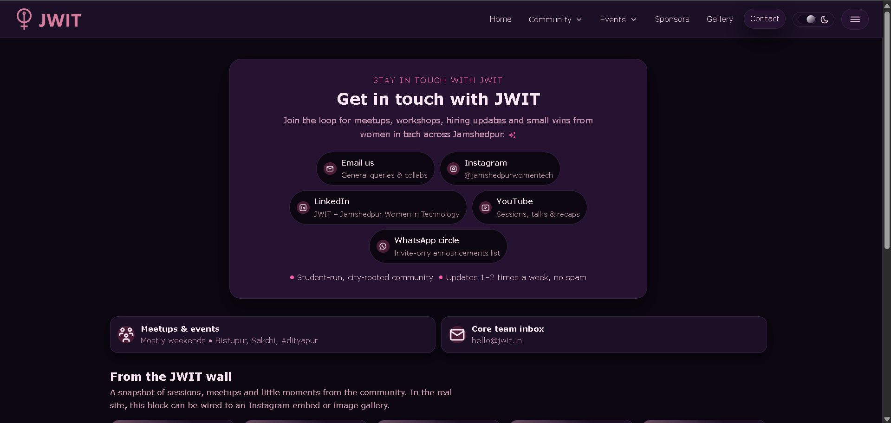

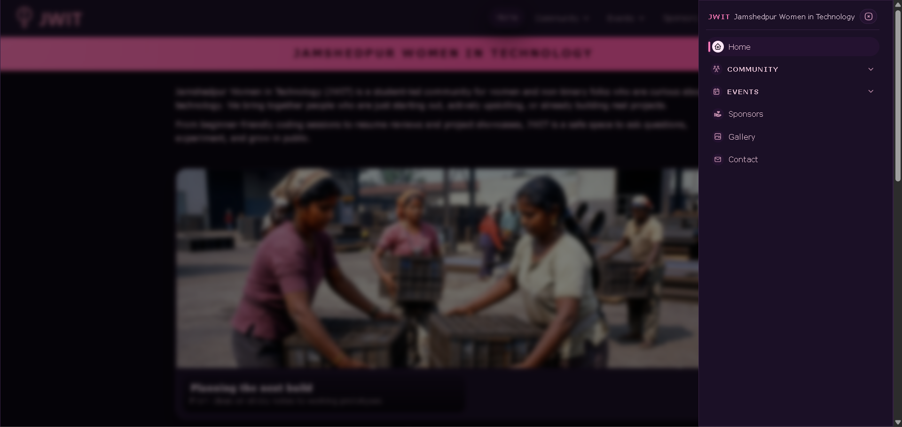

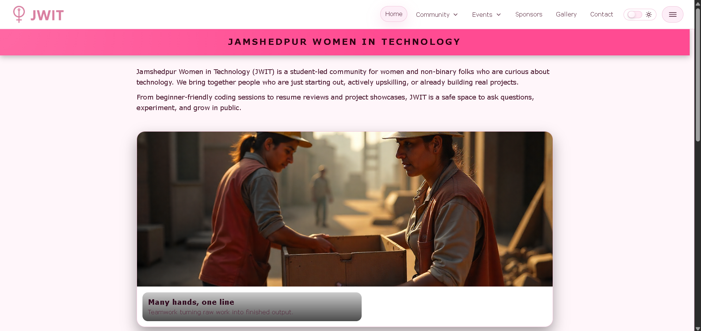

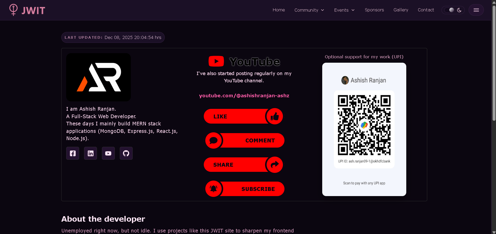

---

## 🚀 Features

### 🌐 Multi-Page Website (SPA Routing)

-   Home
-   Community
    -   Core Team
    -   Membership
    -   Resources
-   Events
    -   All Events
    -   Upcoming Events (`/events#upcoming`)
    -   Past Events (`/events#past`)
-   Sponsors
-   Gallery
-   Contact

Each section is fully routed and behaves like a traditional multi-page site with instant SPA transitions.

---

## 🎨 UI & Experience

-   Fully responsive, mobile-friendly design
-   Styled-Components with a custom theme
-   Smooth micro-interactions, hover effects & animations
-   Drawer navigation with dropdowns
-   Active link tracking using `NavLink` + `end`
-   Theme toggle (light/dark)

---

## 📅 Events System

-   Upcoming / Past event tabs
-   Auto-detect filter based on URL hash
-   Event details modal with image, metadata & description
-   Every card animated with micro-interactions

---

## 👥 Core Team Module

-   Cards with images
-   Hover interactions
-   Modal popup showing full bio
-   Direct Mail & LinkedIn links

---

## 📚 Resources Page

-   Learning Tracks
-   Local City Resources (Schools, Colleges, Libraries, Museums, Sports Grounds, Clubs, Funding Schemes)
-   Downloads section
-   External links section
-   Explore buttons → open detailed modal (PDF-ready layout)

---

## 💝 Sponsors Page

-   Sponsor grid
-   Category badges
-   Stats with count-up animation (e.g., **1200+ Women Reached**)
-   Elegant responsive layout

---

## 🖼️ Gallery Page

-   Masonry-style image grid
-   Lightbox modal on click
-   Smooth keyboard + backdrop interactions

---

## 📬 Contact Page

-   Clean contact options (Email, Instagram, LinkedIn, WhatsApp, etc.)
-   Embedded social feed area (Instagram-style block)
-   Modern minimalist layout

---

## 🏗️ Tech Stack

| Layer      | Tools                              |
| ---------- | ---------------------------------- |
| Frontend   | React (Vite)                       |
| Styling    | Styled-Components                  |
| Routing    | React Router v6                    |
| Icons      | Tabler Icons + React Icons         |
| Animations | CSS Keyframes + Micro Interactions |
| Images     | Local assets + Imported modules    |
| Build Tool | Vite                               |

---

## 🔧 Setup & Development

### 1️⃣ Clone the Repository

```bash
git clone https://github.com/a2rp/jwit-website.git
cd jwit-website

# Install Dependencies
npm install

# Start Development Server
npm run dev

# Build for Production
npm run build
```

---

📜 License

This project is licensed under the MIT License.
You are free to use, modify, and distribute this project with attribution.

---

⭐ Support

If you like this project, please ⭐ star the repository!

## Links

- Portfolio: [https://www.ashishranjan.net](https://www.ashishranjan.net)
- GitHub: [https://github.com/a2rp](https://github.com/a2rp)
- CodePen: [https://codepen.io/ash1198](https://codepen.io/ash1198)
- LinkedIn: [https://www.linkedin.com/in/aashishranjan](https://www.linkedin.com/in/aashishranjan)
- Facebook: [https://www.facebook.com/theash.ashish/](https://www.facebook.com/theash.ashish/)
- YouTube: [https://www.youtube.com/@ashishranjan-ashz?sub_confirmation=1](https://www.youtube.com/@ashishranjan-ashz?sub_confirmation=1)
- Email: [ash.ranjan09@gmail.com](mailto:ash.ranjan09@gmail.com)

## Support

- Support: [https://a2rp-donation-page.netlify.app/](https://a2rp-donation-page.netlify.app/)
- Buy Me A Coffee: [https://buymeacoffee.com/a2rp](https://buymeacoffee.com/a2rp)
- Patreon: [https://patreon.com/a2rp](https://patreon.com/a2rp)
<!-- Project links -->

## Links

- Live: [https://a2rp.github.io/jwit-website/](https://a2rp.github.io/jwit-website/)
- Repository: [https://github.com/a2rp/jwit-website](https://github.com/a2rp/jwit-website)
- Portfolio: [https://www.ashishranjan.net/](https://www.ashishranjan.net/)
- GitHub: [https://github.com/a2rp](https://github.com/a2rp)
- CodePen: [https://codepen.io/ash1198](https://codepen.io/ash1198)
- LinkedIn: [https://www.linkedin.com/in/aashishranjan](https://www.linkedin.com/in/aashishranjan)
- Facebook: [https://www.facebook.com/theash.ashish/](https://www.facebook.com/theash.ashish/)
- YouTube: [https://www.youtube.com/@ashishranjan-ashz?sub_confirmation=1](https://www.youtube.com/@ashishranjan-ashz?sub_confirmation=1)
- Email: [ash.ranjan09@gmail.com](mailto:ash.ranjan09@gmail.com)

## Support

- Support: [https://a2rp-donation-page.netlify.app/](https://a2rp-donation-page.netlify.app/)
- Buy Me a Coffee: [https://buymeacoffee.com/a2rp](https://buymeacoffee.com/a2rp)
- Patreon: [https://www.patreon.com/a2rp](https://www.patreon.com/a2rp)
